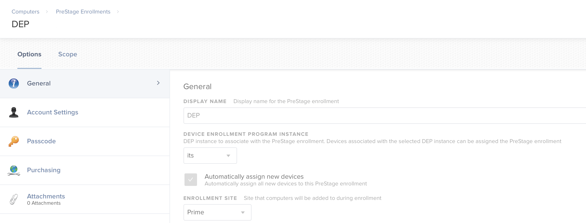
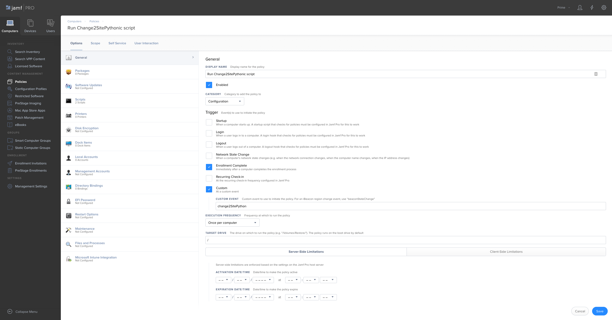
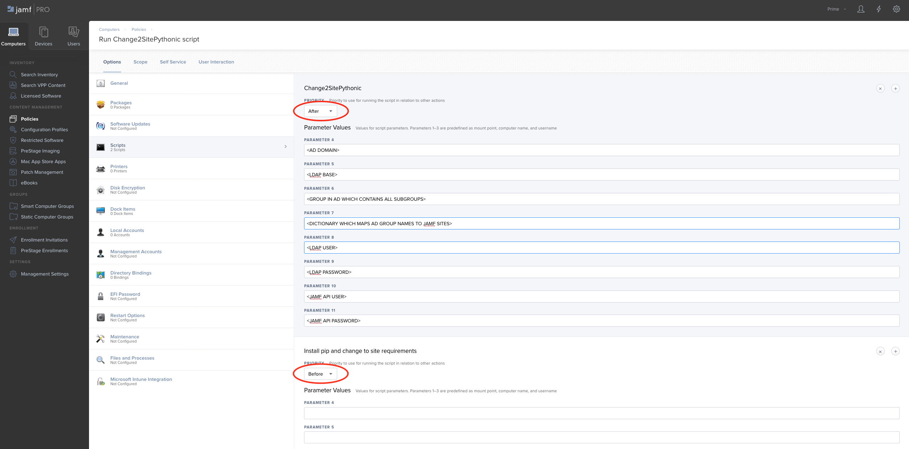
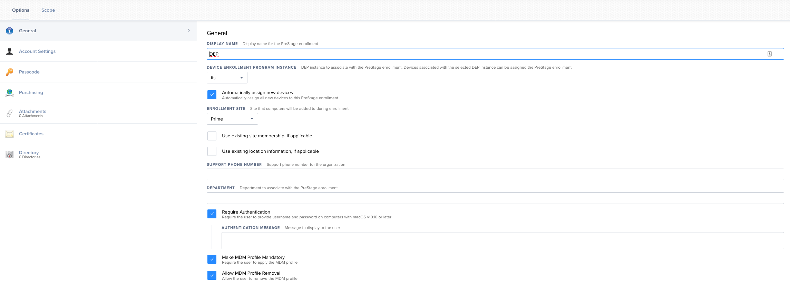

# JAMF Site Mover
A python script to automatically move devices to the correct JAMF site based on
an user logged in during or after enrollment. So depending on the
group-membership of that user in your AD the machine is transferred to the
respective site.

## Motivation and Use cases
*   You are using different sites in JAMF Pro and want to automate your DEP workflow for macOS machines  (- sorry so far not for iOS.)
*   Your workflow requires that the new DEP devices are assigned to a specific JAMF site.
*   You are using "Require Authentication" during your DEP PreStageEnrollment for AD-Authentication

Out of the box JAMF Pro gives you a feature through PreStageEnrollments "Automatically assign new devices" to one site.



So it is easy to get all new DEP devices automatically into one JAMF site. How do you get the machines from this site to the right site? JAMF site Mover helps you to achieve that.

## Requirements
*   JAMF Pro Instance
*   JAMF PreStage Enrollment Group with required authentication (optionally without authentication see [here](#details-about-jamf-site-mover))
*   Active Directory based user login
*   Active Directory Group containing groups which are allowed to enroll devices
*   Python 2 (also works with python 3 but needs other requirements and testing)

## Quickstart
Currently there are two scripts in this repository. One is used to install all
requirements needed for the second script to run properly. And the second one
will be used to move your machine.

The only value you need to replace
in `switch_to_jamfsite.py` is your JAMF API url to tell the script where to
send the requests to.
Once you added both scripts to JAMF you can create a new policy which contains
both scripts.
In the first screenshot you can see a example configuration for
a policy. In this case the policy should run once enrollment is complete and
only once per computer.



Equally important to configuring the policy correctly it is important to run
the `install_requirements.py` script **before** the main script and correctly
configure the scripts parameters.
The order of parameters is important and not interchangeable.

*   Parameter 4 contains AD Domain
*   Parameter 5 contains LDAP Base
*   Parameter 6 contains Group to check membership
*   Parameter 7  contains dictionary in string representation to translate your
AD group names to JAMF Sites
*   Parameter 8 contains LDAP Username
*   Parameter 9 contains LDAP password
*   Parameter 10 contains JAMF API User
*   Parameter 11 contains JAMF API Password

Example for the parameters:
```
yourcompany.ads.example.com
DC=yourcompany,DC=ads,DC=example,DC=com
CN=DEPENROLL,OU=GROUPS,OU=Service
 {'IT-first-ad-group':'IT-first-jamf-site-name','IT-second-ad-group':'IT-second-jamf-site-name','IT-third-ad-group':'IT-third-jamf-site-name'}
ldapuser
secretPassword
jamfapiiser
secretJAMFPassword
```



## Details about JAMF Site Mover
It is important to think about where the script should get the correct user
informations. Currently the script asks the JAMF API for the owner of the
machine and uses his username to determine where to move the machine. This
requires a correct owner in JAMF for each machine and can be achieved by
requiring authentication during enrollment (see screenshot). JAMF Site Mover
uses the fact, that through authentication the machine is owned by that
authenticated user. So depending on the group-membership of that user the
machine is transferred to the respective site.



Another opportunity is to check for the first created user on a machine and use
his username. There is already some code for it in `get_first_username()`
and just needs to replace the part which queries the JAMF API.

## Troubleshoot
In case the devices won't be moved correctly you can first of all check the
policy logs for each device. The script will print out where it wants to move
the device and later state whether it was successful based on the return code
of the JAMF API.
